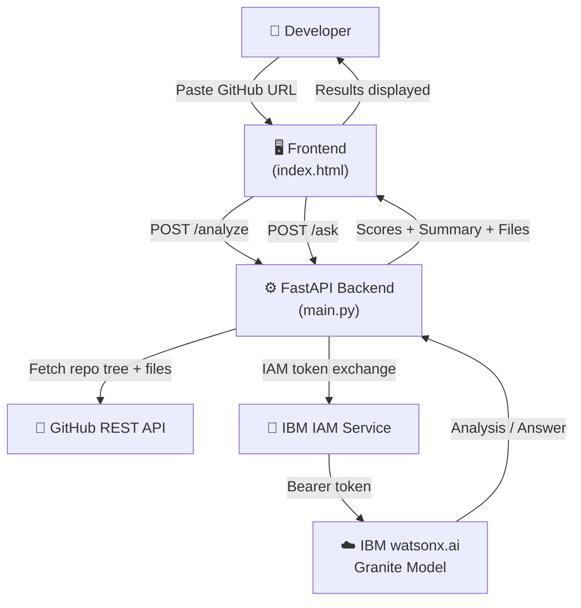
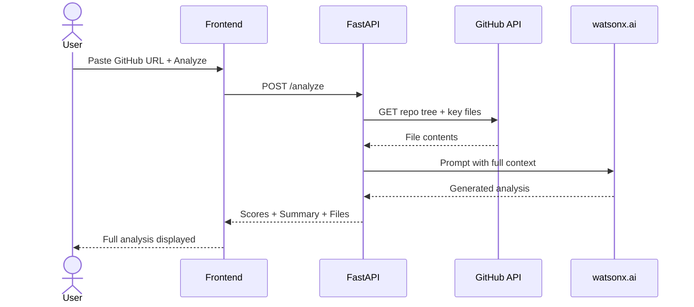

# CodeCompass 🧭
**AI-Powered Repository Intelligence & Developer Onboarding**

> Built for the **IBM Bob Dev Day Hackathon** · Powered by **IBM watsonx.ai** · Model: `ibm/granite-3-8b-instruct`

---

## The Problem

Every developer has been there. You join a new team, clone the repository, and suddenly you're staring at hundreds of files with no idea where to begin. Understanding the architecture, finding the important logic, and figuring out how to run the project takes days — sometimes weeks.

**CodeCompass solves this with one GitHub URL.**

---

## What It Does

Paste any public GitHub repository URL and CodeCompass instantly delivers:

| Feature | Description |
|---|---|
| **Architecture Analysis** | Identifies the pattern (MVC, microservices, monolithic) and explains how components interact |
| **Technology Stack Breakdown** | Languages, frameworks, dependencies, DevOps tooling |
| **Developer Onboarding Roadmap** | Step-by-step guide: first 30 minutes → first day → first week |
| **Code Quality Scoring** | 5-dimensional score across structure, tests, docs, DevOps, and security |
| **Overall Rating** | Weighted composite score with animated SVG ring |
| **Ask Anything** | Natural language Q&A about any aspect of the repository |
| **File Explorer** | Browse, view, copy, and download any file in the repo |

---

## Hackathon Theme Alignment

**"Turn idea into impact faster"**

- ✅ **Get up to speed on existing code quickly** — full repo analysis in one click
- ✅ **Generate documentation** — architecture docs, component maps, onboarding guides on demand
- ✅ **Reduce repetitive effort** — no more manual code archaeology before every new project
- ✅ **Any skill level** — junior devs get the same insight as senior architects

---

## How IBM Bob Built This

IBM Bob was our primary development partner from the first line of code to the final pull request:

- **Next Edit** — Bob predicted and applied chained edits across multiple files during refactoring
- **Code Review** — Bob caught a JWT auth bug and flagged logic issues before every merge
- **`/doc` & `/explain`** — Bob generated all function documentation and the entire README
- **Commits & PRs** — every commit message and pull request was written by Bob
- **Checkpoints** — used to roll back a broken vector store experiment in one click

---

## How IBM watsonx.ai Powers It

- **Model**: `ibm/granite-3-8b-instruct` — IBM's enterprise-grade code-fluent model
- **Auth**: IBM IAM token exchange (`iam.cloud.ibm.com/identity/token`)
- **Endpoint**: `us-south.ml.cloud.ibm.com` · watsonx.ai inference API
- **Deployment**: IBM Cloud Code Engine · Docker

The entire AI pipeline — architecture detection, quality scoring, onboarding generation, and Q&A — runs through IBM Granite. No other AI provider is used.

---

## System Architecture



---

## Request Flow



---

## Quality Scoring

| Dimension | Weight | What It Checks |
|---|---|---|
| Structure | 30% | File organization, separation of concerns, key files |
| Tests | 25% | Test file ratio, coverage setup, test frameworks |
| Documentation | 20% | README, /docs folder, CHANGELOG, CONTRIBUTING |
| DevOps | 15% | Docker, CI/CD pipeline, .env.example, Makefile |
| Security | 10% | .env handling, secrets management, SECURITY.md |

**Overall Score** = `structure×0.30 + tests×0.25 + docs×0.20 + devops×0.15 + security×0.10`

---

## Tech Stack

| Layer | Technology |
|---|---|
| AI / LLM | IBM watsonx.ai · `ibm/granite-3-8b-instruct` |
| Backend | Python 3.11 · FastAPI · uvicorn |
| Frontend | Vanilla HTML/CSS/JS |
| Deployment | IBM Cloud Code Engine · Docker |
| Source Data | GitHub REST API v3 |
| Testing | pytest · pytest-asyncio · pytest-cov |

---

## Project Structure

```
codecompass/
├── main.py              # FastAPI app — watsonx.ai integration, all API routes
├── analyzer.py          # GitHub API client, repo tree builder, smart audit engine
├── index.html           # Full frontend — single-page app
├── test_main.py         # API endpoint tests
├── test_analyzer.py     # Analyzer unit tests
├── requirements.txt     # Python dependencies
├── .env.example         # Environment variable template
├── Dockerfile           # Container setup for IBM Cloud Code Engine
├── pytest.ini           # Test configuration
├── bob_sessions/        # All IBM Bob session exports (proof of Bob usage)
└── IBM_CLOUD_DEPLOYMENT.md  # IBM Cloud deployment guide
```

---

## Running Locally

### Prerequisites
- Python 3.11+
- IBM watsonx.ai API Key + Project ID — [get one here](https://cloud.ibm.com)
- GitHub Personal Access Token (optional — raises rate limit from 60 → 5,000 req/hr)

### Setup

```bash
# 1. Clone the repo
git clone https://github.com/Rex123-hash/codecompass.git
cd codecompass

# 2. Install dependencies
pip install -r requirements.txt

# 3. Set up environment variables
cp .env.example .env
# Open .env and fill in:
#   WATSONX_API_KEY=your_ibm_api_key
#   WATSONX_PROJECT_ID=your_project_id
#   GITHUB_TOKEN=your_github_token  (optional)

# 4. Start the server
uvicorn main:app --host 0.0.0.0 --port 8000
```

Open **http://localhost:8000** in your browser.

### Running Tests

```bash
pytest --tb=short -v
```

---

## Deploying to IBM Cloud

```bash
# Build and run with Docker
docker build -t codecompass .
docker run -p 8000:8000 --env-file .env codecompass
```

See [`IBM_CLOUD_DEPLOYMENT.md`](./IBM_CLOUD_DEPLOYMENT.md) for full IBM Cloud Code Engine instructions.

---

## Team

Built for the **IBM Bob Dev Day Hackathon** · 2026
Powered by **IBM watsonx.ai** · `ibm/granite-3-8b-instruct`
