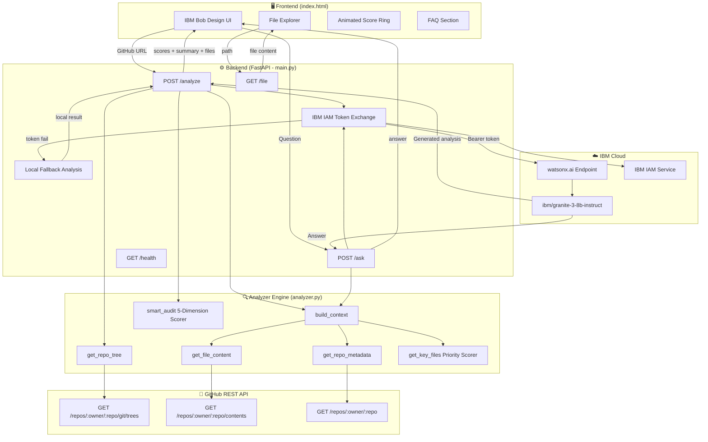
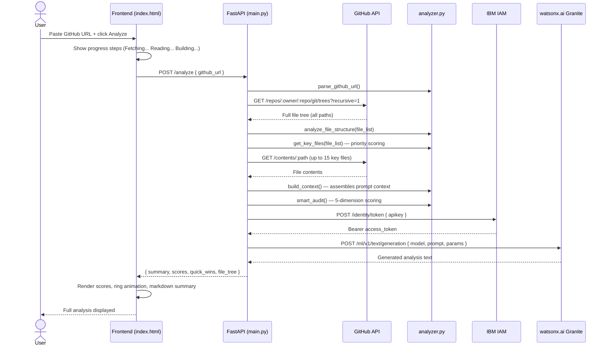
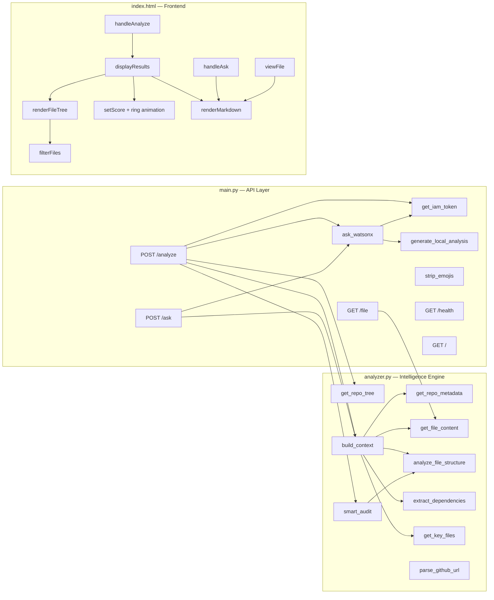
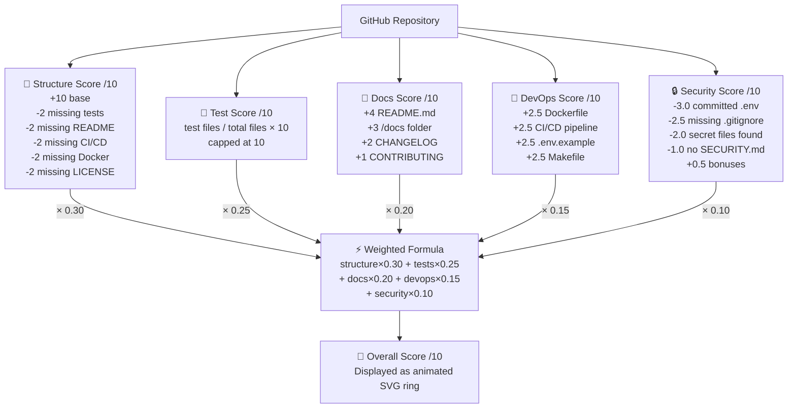
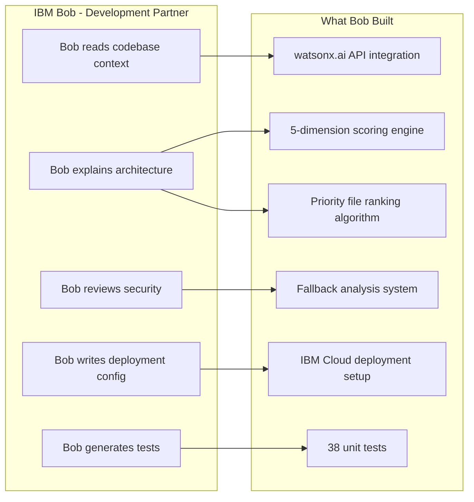

# CodeCompass 🧭
**AI-Powered Repository Intelligence & Developer Onboarding**

> Built for the **IBM Bob Dev Day Hackathon** · Powered by **IBM watsonx.ai** · Model: `ibm/granite-3-8b-instruct`

---

## The Problem

Developers lose hours — sometimes days — trying to understand an unfamiliar codebase before they can contribute. Reading through hundreds of files, deciphering architecture decisions, and figuring out how to even run the project slows everyone down.

**CodeCompass solves this with one GitHub URL.**

---

## System Architecture



---

## Request Flow — Repository Analysis



---

## Code Structure



---

## Scoring System



---

## IBM Bob Integration Flow



---

## What It Does

Paste any public GitHub repository URL and CodeCompass, powered by IBM watsonx.ai (Bob), instantly delivers:

| Feature | Description |
|---|---|
| **Architecture Analysis** | Identifies the pattern (MVC, microservices, monolithic) and explains how components interact |
| **Technology Stack Breakdown** | Languages, frameworks, dependencies, DevOps tooling |
| **Developer Onboarding Roadmap** | Step-by-step guide: first 30 minutes → first day → first week |
| **Code Quality Scoring** | 5-dimensional score across structure, tests, docs, DevOps, and security |
| **Overall Rating** | Weighted composite score with animated SVG ring |
| **Ask Anything** | Natural language Q&A about any aspect of the repository |
| **File Explorer** | Browse, view, copy, and download any file in the repo |

---

## How IBM Bob Powers It

CodeCompass is built entirely on the **IBM watsonx.ai stack**:

- **Model**: `ibm/granite-3-8b-instruct` — IBM's enterprise-grade code-fluent model
- **Platform**: IBM Cloud · watsonx.ai inference endpoint (`us-south.ml.cloud.ibm.com`)
- **Auth**: IBM IAM token exchange (`iam.cloud.ibm.com/identity/token`)
- **Deployment**: IBM Cloud Code Engine · Docker

The entire AI reasoning pipeline — architecture detection, quality scoring, onboarding generation, and Q&A — runs through IBM Granite. No other AI provider is used.

---

## Hackathon Theme Alignment

**"Turn idea into impact faster"**

CodeCompass directly addresses the challenge:

- ✅ **Get up to speed on existing code quickly** — full repo analysis in one click
- ✅ **Generate documentation** — produces architecture docs, component maps, onboarding guides on demand
- ✅ **Reduce repetitive effort** — no more manual code archaeology before every new project
- ✅ **Any skill level** — junior devs get the same insight as senior architects

---

## Quality Scoring System

| Dimension | Weight | What It Checks |
|---|---|---|
| Structure | 30% | File organization, separation of concerns, key files present |
| Tests | 25% | Test files ratio, coverage setup, test frameworks |
| Documentation | 20% | README, /docs folder, CHANGELOG, CONTRIBUTING |
| DevOps | 15% | Docker, CI/CD pipeline, .env.example, Makefile |
| Security | 10% | .env handling, secrets management, SECURITY.md |

**Overall Score** = `structure×0.30 + tests×0.25 + docs×0.20 + devops×0.15 + security×0.10`

---

## Tech Stack

| Layer | Technology |
|---|---|
| AI / LLM | IBM watsonx.ai · `ibm/granite-3-8b-instruct` |
| Backend | Python 3.11 · FastAPI · uvicorn |
| Frontend | Vanilla HTML/CSS/JS · IBM Bob design language |
| Deployment | IBM Cloud Code Engine · Docker |
| Source Data | GitHub REST API v3 |
| Testing | pytest · pytest-asyncio · pytest-cov |

---

## Project Structure

```
codecompass/
├── main.py              # FastAPI app — watsonx.ai integration, all API routes
├── analyzer.py          # GitHub API client, repo tree builder, smart audit engine
├── index.html           # Full frontend — IBM Bob design language, single-page app
├── test_main.py         # API endpoint tests (18 tests)
├── test_analyzer.py     # Analyzer unit tests (20 tests)
├── requirements.txt     # Python dependencies
├── .env.example         # Environment variable template
├── Dockerfile           # Container setup for IBM Cloud Code Engine
├── manifest.yml         # IBM Cloud Foundry deployment config
├── Procfile             # Process definition for Cloud Foundry
├── runtime.txt          # Python version specification
├── pytest.ini           # Test configuration
├── bob-report/          # IBM Bob session export (proof of Bob usage)
│   └── bob-session-report.md
└── IBM_CLOUD_DEPLOYMENT.md  # Step-by-step IBM Cloud deployment guide
```

---

## Running Locally

### Prerequisites
- Python 3.11+
- IBM watsonx.ai API Key + Project ID ([get one here](https://cloud.ibm.com))
- GitHub Personal Access Token (optional — increases rate limit from 60 → 5,000 req/hr)

### Setup

```bash
git clone https://github.com/Rex123-hash/codecompass.git
cd codecompass

pip install -r requirements.txt

# Copy env template and fill in your values
cp .env.example .env
# Edit .env with your WATSONX_API_KEY, WATSONX_PROJECT_ID, GITHUB_TOKEN

uvicorn main:app --host 0.0.0.0 --port 8000
```

Open `http://localhost:8000`

### Running Tests

```bash
pytest --tb=short -v
```

---

## Deploying to IBM Cloud

See [`IBM_CLOUD_DEPLOYMENT.md`](./IBM_CLOUD_DEPLOYMENT.md) for full instructions.

**Docker / Code Engine:**
```bash
docker build -t codecompass .
docker run -p 8000:8000 --env-file .env codecompass
```

---

## Team

Built for the **IBM Bob Dev Day Hackathon**
Powered by **IBM watsonx.ai (Bob)** · `ibm/granite-3-8b-instruct`
IBM Bob Dev Day · 2026
